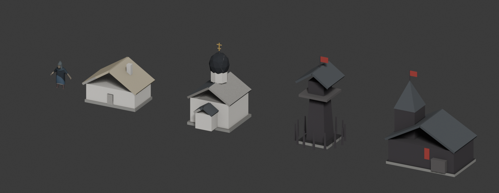
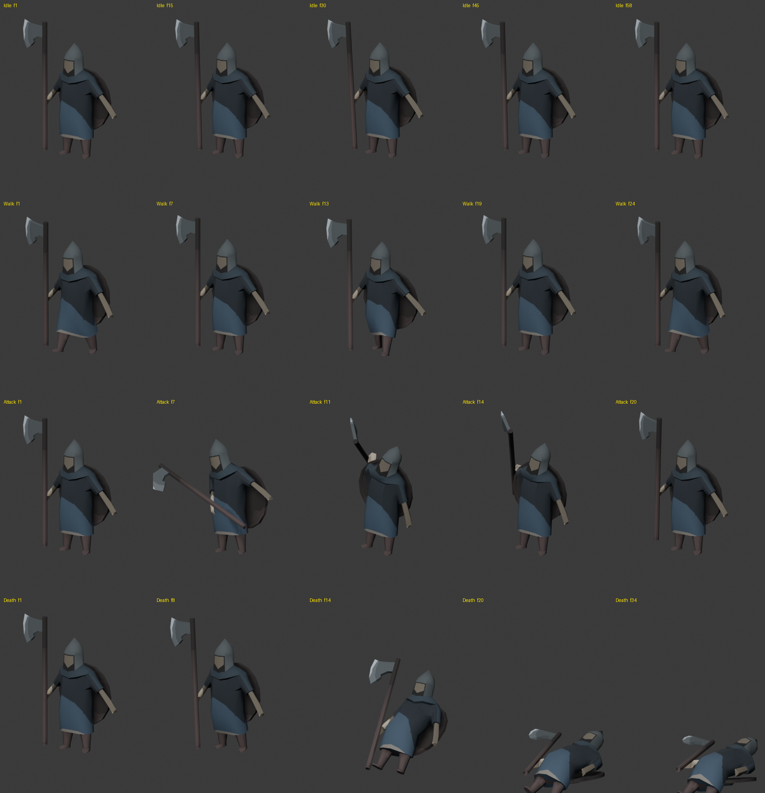
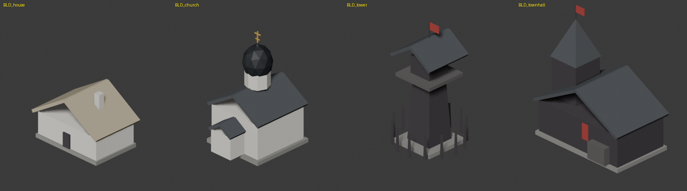

# Работа Claude по ассетам — 5 сентября 2026

Напоминалка о том, что было сделано, где лежит и чего ещё не хватает.
Проект называется **The King Is Always Right**; имя папки `HeroDefenseBuilder` — старое,
осталось от другого чата, отдельным проектом не является.



---

## 1. Связь Claude ↔ Blender (важно для следующей сессии)

Работа велась **напрямую в открытом Blender**, через MCP. Цепочка из трёх звеньев:

```
Claude Code  ⇄ stdio ⇄  blender-mcp  ⇄ TCP 127.0.0.1:9876 ⇄  аддон MCP в Blender
```

- **Blender** — Steam-версия 5.2.1 LTS, `E:\Program Files (x86)\Steam\steamapps\common\Blender`.
  Официальному аддону Blender Lab нужен 5.1 или новее.
- **Аддон** — «MCP» от Blender Lab, ставится с blender.org/lab/mcp-server (ссылку в окно Blender
  перетащить дважды: первый раз добавляется репозиторий, второй — сам аддон).
- **Мост** — `C:\Users\my3dc\.local\bin\blender-mcp.exe`, поставлен командой:
  `uv tool install --with "mcp<2" "git+https://projects.blender.org/lab/blender_mcp.git#subdirectory=mcp"`
- **Конфиг** — сервер `blender` в `.mcp.json` в корне репозитория.

### Что включить перед работой

1. Blender открыт, файл персонажей загружен.
2. Edit → Preferences → **System → Online Access** — включить, иначе аддон не стартует
   и пишет «Online access must be enabled in the system preferences».
3. Edit → Preferences → Add-ons → **MCP** — галочка. Автостарт там включён по умолчанию.
4. Проверка живости связи: `netstat -an | findstr :9876` — должно быть `LISTENING`.

### Грабли

Без пина `mcp<2` мост падает на старте: в MCP SDK 2.x класс `FastMCP` переименован
в `MCPServer`, а код Blender Lab написан под 1.x. Установка при этом проходит «успешно»,
а исполняемый файл не запускается вовсе.

---

## 2. Что лежит в проекте

### Модели

| файл | что это |
|---|---|
| `Assets/ART/Models/KING_warrior.fbx` | воин: тело + топор + щит, риг, скиннинг, 4 анимации |
| `Assets/ART/Models/Buildings/BLD_house.fbx` | дом крестьянина |
| `Assets/ART/Models/Buildings/BLD_church.fbx` | церковь |
| `Assets/ART/Models/Buildings/BLD_tower.fbx` | дозорная башня |
| `Assets/ART/Models/Buildings/BLD_townhall.fbx` | ратуша |

### Текстуры

| файл | что это |
|---|---|
| `Assets/ART/Textures/KING_hero_albedo.png` | 512×512, воин + топор + щит в одном атласе |
| `Assets/ART/Textures/BLD_albedo.png` | 1024×1024, все четыре здания в одном атласе |

Обе запечены в Cycles: чистый цвет материалов плюс отдельный AO, смешаны с силой 0.5–0.55.
Полное затенение убило бы плоский стиль. Выборка текстуры — **Closest**, цвета плоские,
фильтрация их только мылит. В импорте Unity имеет смысл поставить Filter Mode: Point.

### Референсы

`Assets/ART/References/Storozha/` — шесть листов от ChatGPT:
юниты, короли, два листа зданий и два листа уровней-островов.

---

## 3. Воин: что именно сделано



- **Геометрия** — копия исходного `warrior` из `Chars.blend` с применённым Mirror.
  246 вершин, 250 полигонов.
- **UV** — тело, топор и щит развёрнуты **в одно** UV-пространство. Разворачивалось единым
  склеенным мешем, иначе упаковка идёт по каждому объекту отдельно и острова накладываются.
  Плотность текселей выровнена: 1.115 / 1.115 / 1.119.
- **Риг** — 13 костей: root, hips, spine, chest, head, руки с кистями, ноги со ступнями.
  Координаты сняты с самой геометрии.
- **Скиннинг** — автовеса, вершин без веса ноль. Топор и щит не скинятся, а подвешены
  к костям `hand_R` и `hand_L`.
- **Анимации, 30 fps** — `KING_Idle` (60 кадров, зациклена), `KING_Walk` (25, зациклена),
  `KING_Attack` (24), `KING_Death` (40).

### Важно про анимации

**Каждый клип задаёт позу всех 13 костей.** Это не избыточность: пока `root` ключевался
только в Death, его поза протекала в остальные клипы, и воин лежал даже в Idle.
Если будете добавлять новые клипы — держите это правило.

Анимации сделаны **по принципам**, а не скопированы с Bad North. Запись геймплея разбиралась,
но юнит там занимает по высоте около 40 пикселей: оттуда считывается тайминг и характер
движения, позы конечностей — нет. Уровень качества — рабочая болванка: движение читается,
проработки дуг и веса нет.

---

## 4. Здания: блокинг-драфт



Собраны процедурно из примитивов по листу
`References/Storozha/buildings_church_townhall_tower_house.png`.
Полигонаж после триангуляции n-гонов: дом 42, ратуша 59, церковь 174, башня 202.

Палитра снята кластеризацией цветов прямо с листа: белёная стена `#E0DDD5`,
тёмное дерево `#3E3A3E`, кровля `#4A4E52`, солома `#B3A98F`, купол `#23262B`,
золото креста `#C6A24A`, красный стяг `#A63E3A`.

Это **драфт для расстановки и проверки композиции**, не финальные ассеты. Чего в них нет:
окон, крылец, лестниц, деталей из нижней строки концепт-листа (бочки, фонари, надгробия),
травяных площадок-островков.

---

## 5. Проверка геометрии

Прогнал все семь мешей перед экспортом:

| проверка | результат |
|---|---|
| дубликаты вершин | 0 во всех мешах |
| не-манифолд рёбра | 0 во всех мешах |
| перевёрнутые нормали | 0 (пересчёт наружу ничего не изменил) |
| n-гоны | были — 2 у топора, 3 у щита, 3 у церкви, 28 у башни; **триангулированы** |
| применённый масштаб | у всех объектов scale = 1 |

Одно замечание, которое трогать не стал: у исходного `shield` **16 открытых рёбер** —
щит не замкнут по ободу. Это геометрия из `Chars.blend`, не моя; на рендере не видно,
но если щит попадёт в запекание нормалей или физику — стоит закрыть.

---

## 6. Масштаб — открытый вопрос

Единой единицы в проекте пока нет. Сейчас всё сделано в масштабе исходного `warrior`:

- воин — **0.527 м** в высоту;
- дом — 0.74, церковь и ратуша — около 1.5, башня — 1.62.

То есть воин мельче реального человека примерно втрое. Когда решите, чему равна игровая
единица, всё это надо будет пересчитать разом — и модели, и анимации.

---

## 7. Что НЕ проверено

Импорт в Unity никто не смотрел. MCP-сервер `unity` в той сессии не подключился,
поэтому Animator, масштаб при импорте, ориентация осей и работа клипов проверены не были —
только сам факт, что FBX содержит все четыре анимации, риг и меши.

При первом импорте стоит проверить:

- Rig → Animation Type: Generic (Humanoid тут не подойдёт, скелет нестандартный);
- клипы `KING_Idle` и `KING_Walk` — поставить Loop Time;
- Scale Factor: модели экспортированы без масштабирования, в метрах Blender;
- у обеих текстур — Filter Mode: Point.

---

## 8. Исходники вне репозитория

Blender-файлы лежат отдельно, в репозиторий не попадают:

- `F:\Work\KingIsAlwaysRight\Chars\Chars.blend` — рабочий файл (не трогался);
- `F:\Work\KingIsAlwaysRight\Chars\Chars_units_wip.blend` — копия со всей этой работой:
  коллекции `HERO` (воин с ригом), `BUILD` (здания), `UNITS` (пять юнитов-вариаций),
  `UNITS_RIG` (камера и свет для служебных рендеров);
- `F:\Work\KingIsAlwaysRight\Chars\hunyuan_refs\` — нарезанные картинки и ТЗ для Hunyuan3D.

В `UNITS` лежит незаконченное: пять вариаций на базе воина — милиция, мечник, копейщик,
лучник, волхв. У них есть геометрия и оружие, но нет UV, текстуры и рига.
